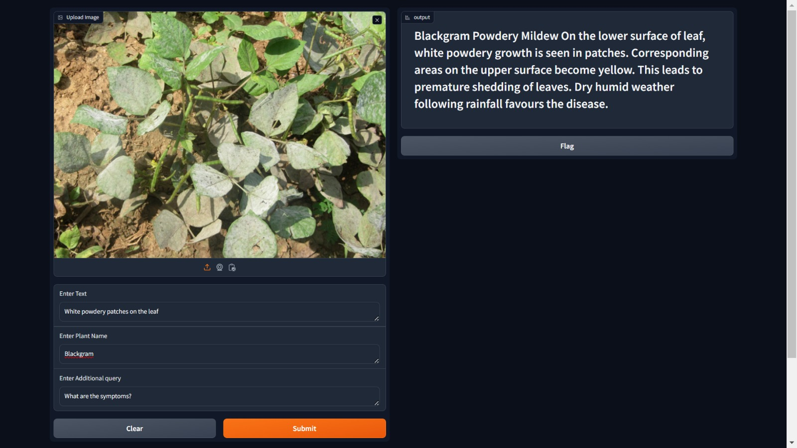

## Multimodal Few-shot Learning For Plant Disease Detection With Contrastive Pre-Training And Query Addressal

Every year, the global agrarian economy faces severe losses inflicted by plant diseases. Overcoming this is a significant challenge due to the expertise required in plant disease identification and classification. While machine learning applications are not new to solving this problem, they rely on heavy, non-local datasets which is a hurdle when they have to be deployed in specific regions. To address this, we scrape a novel dataset, tailored to the state of Tamil Nadu. To provide additional context to the images, we propose to develop a second mode of data, text descriptions, which are more abundantly available and can be augmented using Large Language Models. Given the lack of large, structured data for the task, we intend to use a few-shot learning (FSL) approach. Specifically, we propose to use a two-step approach for FSL that incorporates contrastive pre-training to extract better latent features and a prototype based classification network to perform disease detection. The detected disease combined with the farmers' question is used to query an advisory document using a Retrieval Augmented Generation pipeline. Our approach achieved an accuracy of 93\% in disease classification and a context precision score of 0.87 in query resolution. This shows great potential to contribute to the food security and sustainable agriculture landscape of Tamil Nadu. 

### Sample output of the system

